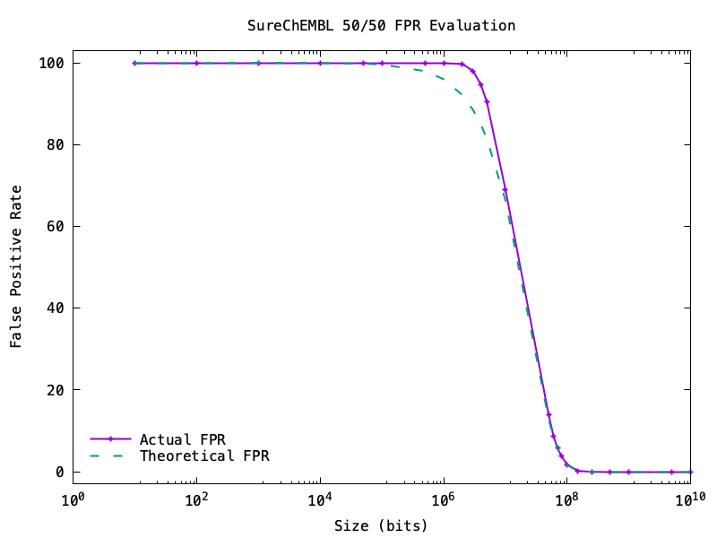

# Molbloom in Rust

Fast look-up of molecules. 

## Disclaimer of Warranty 

This work is provided on an "AS IS" BASIS, WITHOUT WARRANTIES OR CONDITIONS OF ANY KIND, either express or implied, including, without limitation, any warranties or conditions of TITLE, NON-INFRINGEMENT, MERCHANTABILITY, or FITNESS FOR A PARTICULAR PURPOSE. You are solely responsible for determining the appropriateness of using or redistributing the work and assume any risks associated with your exercise of permissions under the License.
## Sources
- Based on the ideas of: Medina & White (2023), [Bloom filters for molecules](https://jcheminf.biomedcentral.com/articles/10.1186/s13321-023-00765-1), *Journal of Cheminformatics* 15:1.
- Data from SureChEMBL, CC Attribution-ShareAlike 3.0 Unported: Papadatos_et al._ (2016). [SureChEMBL: a large-scale, chemically annotated patent document database](https://doi.org/10.1093/nar/gkv1253), *Nucleic Acids Research Database* Issue, 44.

## Usage
A Bloom filter is included in this repository, created from the quartery SureChEMBL dump (filter created in early Dec 2024).

With the [Rust cargo build tool installed](https://doc.rust-lang.org/cargo/getting-started/installation.html) you can run the progam and paste in SMILES values:

```
cargo build --release ./target/release/molbloom -f model/surechembl_smiles_2024-12-05.bin query
CCC(=O)C1(CC1)C(=O)OC
true
O=C(C)Oc1ccccc1C(=O)O
false
```

Or you can give the program a file, one string per line.

To build the filter, asusming you have the data (see this [blog post for an example](https://r.dallaway.com/posts/fast-molecule-patent-checking)), you can construct a new filter targetting a 1% false positive rate with:

```
/target/release/molbloom -f model/surechembl_smiles_2024-12-05.bin \ 
    build --fpr 0.01 --num-items 23465171 < smiles.txt
```

## False positive evaluation
Based on the example in Bloom & White, the FPR was calculated by building a filter on one half of the SureChEMBL SMILES data and testing on the other half.  Each half roughly 11.7m molecules, using the SipHash-1-3 hasher:

